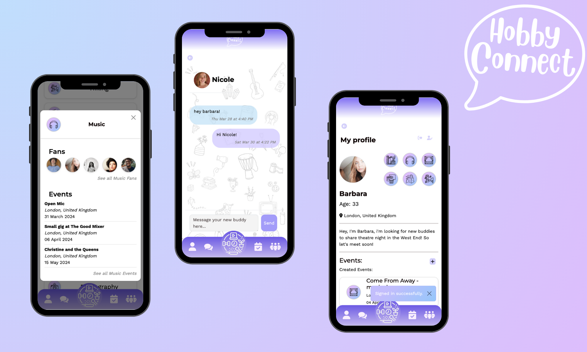

# HobbyConnect

HobbyConnect is a fun and straightforward mobile web app to connect people who share the same hobbies with an icon-based matching system for quick connections as well as the possibility to create events and share them.  
This project has been completed in 2 weeks during Le Wagon bootcamp.

You can find our web app here 👉 [HobbyConnect](https://www.hobbyconnect.lol/)

And you can find the demo there 👉 [Demo](https://www.youtube.com/watch?v=6XzfZSLZIY4&feature=youtu.be)

# Features

- Matching icon system
- Localisation feature
- Creation of a new event
- Chat feature

# Build With

          </a> 

# Team

This project has been completed by [Luisa Aslanidis](https://github.com/luepistaxis), [Laura Zocca](https://github.com/laurazocca), [Matthew Gregory](https://github.com/matthewegregory), and [Barbara Bouillicot](https://github.com/barbara-bouillicot)

